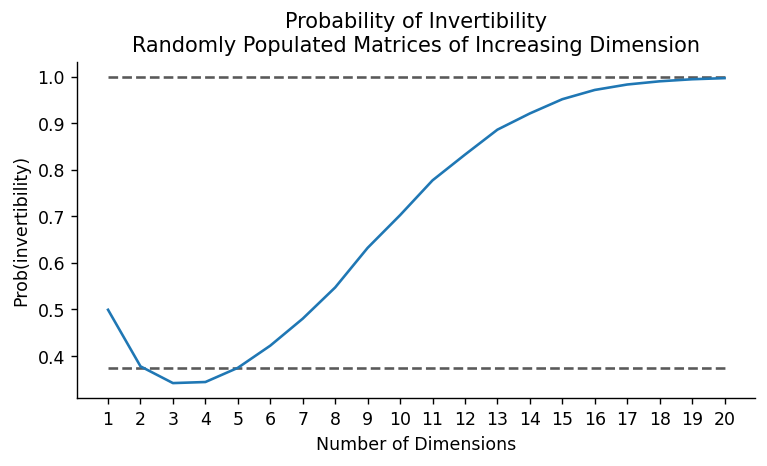

# Matrix Invertibility Exploration with Monte Carlo Methods

## Introduction

This project aims to explore the probability that randomly populated binary matrices (populated with 0s and 1s) of increasing dimensions are invertible. We employ Monte Carlo simulation methods to generate a large number of matrices for each dimension and calculate the proportion that are invertible.

Consider an $n$x$n$ matrix $A$ where each element is uniformly randomly populated with either a zero or 1. What is the probability this randomly populated matrix is invertible? If $n = 1$ this is straightforward: $50 \%$. But this quickly becomes a nuanced problem as $n\rightarrow \infty$. 

Let's consider $n=2$ for the matrix $A$ defined below. Since each of the $4$ entries can either be $0$ or $1$, there are $2^4=16$ possible forms the matrix can take. We know a matrix is invertible $iff$ its determinant is non-zero. Thus, we determine which of the 16 possible matrices have a non-zero determinant to identify those that are invertible and the probability that a randomly populated binary matrix is invertible.  

$$
A=
\begin{bmatrix}
a & b\\
c & d
\end{bmatrix} a, b, c, d \in \{0, 1\}$$

$$det(A) \neq 0 \Rightarrow ad-bc\neq0 \Rightarrow ad \neq bc$$

Turns out this is true of 6 possible matrices, which implies that for $n=2$, there is a $\frac{6}{16}=37.5\%$ chance the matrix is invertible. For $n=3$ though, there are $2^9=512$ possible matrices, so Monte Carlo methods are helpful to study how the probability of invertability scales for higher dimension matrices.

## Objectives

- **Simulation of Binary Matrices:** Generate matrices of increasing dimensions, each element being 0 or 1 with equal probability.
- **Invertibility Check:** Determine if each generated matrix is invertible by checking if the determinant is non-zero.
- **Statistical Analysis:** Analyze the probability of invertibility as a function of matrix dimension and visualize the results.
- **Performance Optimization:** Implement parallel processing and garbage collection to speed up simulations and free up memory.

## Results

